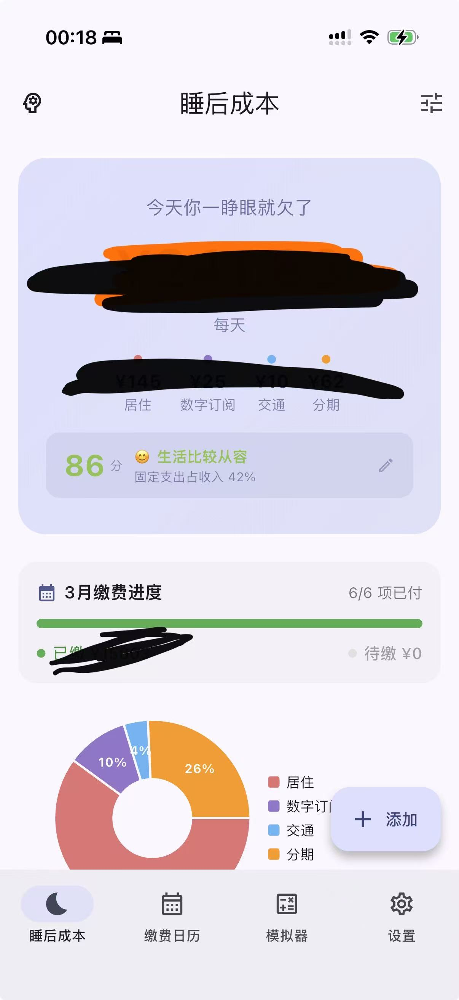
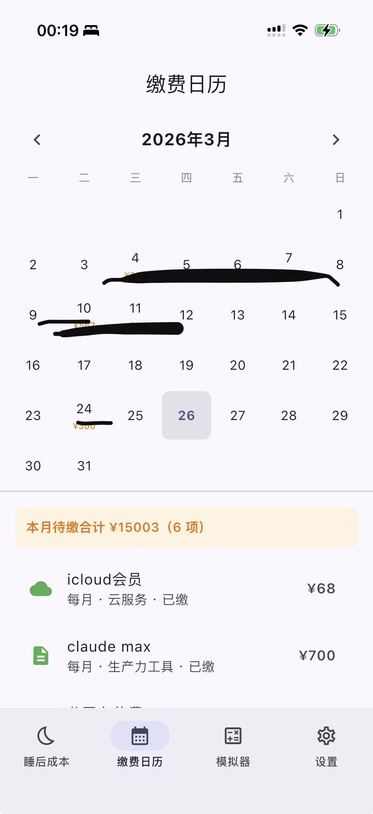
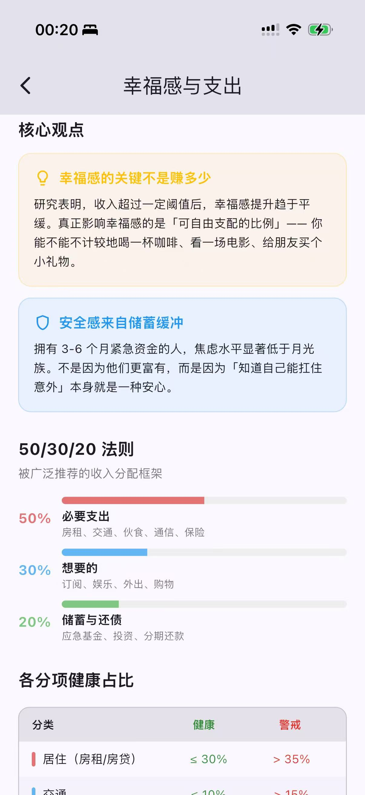

<div align="center">

# LifeCostTracker

**每天醒来，你就欠了这么多钱**

[](https://flutter.dev)
[](https://dart.dev)
[](https://www.apple.com/ios)
[](LICENSE)

一款通过「睡后成本」视角管理个人固定支出的 App

*你的生活燃烧率是多少？*

</div>

---

## What is 睡后成本？

「睡后收入」人人追求，但你知道你的**睡后成本**是多少吗？

每天睁开眼睛，房租、水电、订阅、分期……这些固定支出已经在消耗你的钱包。LifeCostTracker 帮你把这个数字**可视化**，让每一笔消费决策都有据可依。

## Features

<table>
<tr>
<td width="50%">

### 睡后成本 Dashboard
实时展示你的生活燃烧率。按日/月/季/年灵活切换，饼图展示分类占比。

### 缴费日历
月历视图查看所有缴费计划。到期日标注金额，点击查看具体项目。

### 幸福感评分
0-100 分评分体系。分项健康度可视化，一眼看出哪个分类超标。

</td>
<td width="50%">

### 承担能力模拟
「如果我再买一个…」输入金额即时模拟对每日成本和幸福感评分的影响。

### 智能缴费追踪
到期自动推进，支持提前标记。左滑标记付款，简单直觉。

### 双周期账单
月租 4500 但按季付？分离心智周期和实际付款周期，自动换算。

</td>
</tr>
</table>

## Screenshots

<div align="center">

&nbsp;&nbsp;

&nbsp;&nbsp;

</div>

## Category System

8 大类 **·** 26 子分类，覆盖日常固定支出：

> **居住** 房租 / 房贷 / 水电煤 / 物业费 / 停车费
>
> **交通** 车贷 / 车险 / 通勤月卡 / 加油
>
> **生活** 日常伙食 / 日用品
>
> **通信** 话费 / 宽带
>
> **数字订阅** 流媒体 / 生产力工具 / 云服务 / 游戏会员
>
> **医疗健康** 保险 / 健身 / 医疗体检
>
> **教育** 培训网课 / 书籍订阅
>
> **其他** 宠物 / 人情往来 / 其他

## Happiness Score

基于固定支出占税后收入的比例，0-100 分综合评分：

```
 95-100  优秀   ≤30%   😎  财务自由度高
 80-95   良好   ≤50%   😊  生活比较从容
 60-80   一般   ≤65%   😐  收支基本平衡
 35-60   偏紧   ≤80%   😰  有些紧张
  0-35   危险   >80%   😵  压力很大
```

分项对比各大类占收入比例与建议值，超标项高亮提醒。

## Tech Stack

| 层级 | 技术 |
|------|------|
| Framework | Flutter 3.41+ |
| Language | Dart 3.11+ |
| Architecture | Clean Architecture + MVVM |
| State | Provider |
| Storage | Hive (NoSQL) |
| Charts | fl_chart |

## Quick Start

```bash
git clone https://github.com/imK3/LifeCostTracker.git
cd LifeCostTracker/life_cost_tracker
flutter pub get
flutter run
```

> iOS 部署、环境配置等详见 [docs/DEVELOPMENT.md](docs/DEVELOPMENT.md)

## Project Structure

```
lib/
├── domain/          # 业务层：实体、仓库接口、用例
│   ├── entities/    # RecurringCost, InstallmentPlan, SleepCostSummary...
│   ├── repositories/
│   └── usecases/
├── data/            # 数据层：Hive 适配器和仓库实现
│   ├── adapters/
│   └── repositories/
└── presentation/    # 展示层：Views + ViewModels
    ├── viewmodels/
    └── views/       # Dashboard, Calendar, Simulator, Settings...
```

## License

[MIT](LICENSE)

---

<div align="center">

*Built with Flutter & Hive*

*v2.0 · 2026-03-26*

</div>
